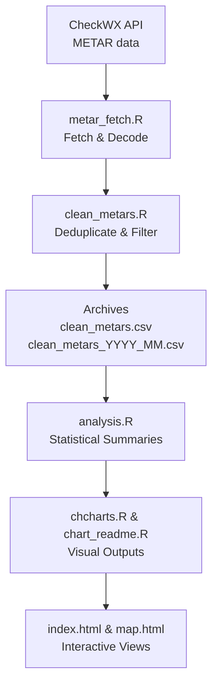

# Canada Flight Conditions Research Project  

  

---

## 🌍 Overview  

This project automates the **collection, cleaning, analysis, and visualization of decoded METAR reports** for a curated network of **50 Canadian airports**, continuously tracked via a GitHub-hosted pipeline.  

The objective is to establish the first open, reproducible, and geographically comprehensive **national climatology of aviation flight conditions** in Canada.  

This work connects **aviation safety, meteorology, geography, and climate science** by systematically monitoring:  

- **Flight categories**: VFR, MVFR, IFR, LIFR  
- **Meteorological variables**: temperature, dew point, humidity, wind, visibility, altimeter pressure, and cloud layers  
- **Temporal dynamics**: hourly, daily, seasonal, and multi-year trends  

The pipeline runs fully automatically in the cloud, producing structured datasets and graphics that can be accessed for research, policy, and operational applications.  

---

## 🛰️ Airport Network  

The project monitors **50 airports across Canada**, chosen to represent the full diversity of Canadian climates, operational environments, and aviation demands.  

### Ontario (15)  
- **CYER** – Fort Severn  
- **CYAT** – Attawapiskat  
- **CYMO** – Moosonee  
- **CYPL** – Pickle Lake  
- **CYQT** – Thunder Bay  
- **CYAM** – Sault Ste. Marie  
- **CYTS** – Timmins  
- **CYSB** – Sudbury  
- **CYYB** – North Bay  
- **CYOW** – Ottawa/Macdonald–Cartier International  
- **CYGK** – Kingston  
- **CYQG** – Windsor  
- **CYVV** – Wiarton  
- **CYYZ** – Toronto Pearson International  
- **CYQA** – Muskoka  

### British Columbia (6)  
- **CYVR** – Vancouver International  
- **CYYJ** – Victoria International  
- **CYLW** – Kelowna International  
- **CYXS** – Prince George  
- **CYXT** – Terrace/Kitimat  
- **CYQQ** – Comox  

### Alberta (4)  
- **CYYC** – Calgary International  
- **CYEG** – Edmonton International  
- **CYMM** – Fort McMurray  
- **CYQF** – Red Deer  

### Saskatchewan & Manitoba (4)  
- **CYXE** – Saskatoon  
- **CYQR** – Regina  
- **CYWG** – Winnipeg International  
- **CYBR** – Brandon  

### Quebec (8)  
- **CYUL** – Montréal–Trudeau International  
- **CYHU** – Montréal/Saint-Hubert  
- **CYQB** – Québec City Jean Lesage International  
- **CYVO** – Val-d’Or  
- **CYUY** – Rouyn-Noranda  
- **CYZV** – Sept-Îles  
- **CYBC** – Baie-Comeau  
- **CYRJ** – Roberval  

### Atlantic Canada (6)  
- **CYHZ** – Halifax Stanfield International  
- **CYYG** – Charlottetown  
- **CYQM** – Moncton  
- **CYFC** – Fredericton  
- **CYYT** – St. John’s International  
- **CYQY** – Sydney (NS)  

### Northern Territories & Arctic (7)  
- **CYXY** – Whitehorse (Yukon)  
- **CYZF** – Yellowknife (Northwest Territories)  
- **CYFB** – Iqaluit (Nunavut)  
- **CYRT** – Rankin Inlet (Nunavut)  
- **CYBK** – Baker Lake (Nunavut)  
- **CYRB** – Resolute Bay (Nunavut)  
- **CYCO** – Kugluktuk (Nunavut)  

---

## 🔄 Data Pipeline  

The system is powered by a **fully automated R workflow** executed on GitHub Actions.  

## 🔄 Workflow Steps  

### Fetch METARs  
- **[`metar_fetch.R`]** retrieves decoded reports at the top and bottom of every hour (xx:00 and xx:30).  
- Captures: current flight category (ex. VFR), temperature, dew point, humidity, wind, visibility, altimeter, cloud layers, and raw METAR text.  

### Clean & Deduplicate  
- **[`clean_metars.R`]** removes redundant or unchanged records.  
- Ensures only meaningful meteorological changes are stored.  

### Archive  
- **`all_metars.csv`** – master dataset (complete record). These may have duplicates
- **`metars_YYYY_MM.csv`** – monthly append-only archives. These may have duplicates
- **`clean_metars.csv`** – cleaned dataset. No duplicates. 
- **`clean_metars_YYYY_MM.csv`** – cleaned monthly dataset. No duplicates.

### Analyze  
- **[`analysis.R`]** produces:  
  - `daily_averages.csv` – meteorological means per day  
  - `flight_summary.csv` – counts of each flight category  
  - `time_daily.csv`, `time_alltime.csv`, `time_overall.csv` – time allocation by flight condition (LIFR, IFR, MVFR, VFR) 

### Visualize  
- **[`charts.R`]** – airport-level bar charts  

### Front-End Views  
- **`index.html`** – card-based dashboard for browsing METAR summaries. Select individual airports. More functions coming soon! 
- **`map.html`** – interactive geographic visualization of flight conditions. More functions coming soon!

All artifacts are updated twice hourly and committed automatically for **open, reproducible research**.  

---

## 📊 Research Applications  

This project supports applications across aviation, meteorology, and geography:  

- **Aviation Safety** – quantify IFR/LIFR frequency for operational planning.  
- **Climatology** – develop daily, seasonal, and annual climatologies at each airport.  
- **Regional Geography** – compare weather impacts across Arctic, coastal, prairie, and mountain environments.  
- **Fog & Ceiling Studies** – identify hotspots for low visibility and low ceiling events.  
- **Climate Change Monitoring** – assess long-term shifts in aviation-relevant weather.  
- **Policy Support** – provide data-driven insights for infrastructure and safety policy.  

---

## 📅 Research Milestones  

| Timeline   | Milestones & Deliverables                                    |
|------------|---------------------------------------------------------------|
| 2–3 months | Initial station-level comparisons and anomaly detection       |
| 6 months   | Seasonal climatologies across provinces and regions           |
| 12 months  | Full annual cycle climatology and inter-airport analysis      |
| Multi-year | Identification of climate-driven shifts and aviation impacts  |  

---

## 🚀 Future Directions  

- **Interactive dashboards** for live condition monitoring.  
- **Spatial interpolation maps** for provincial/national overviews.  
- **Expanded datasets**: TAFs, PIREPs, radar, and satellite integration.  
- **Collaborative partnerships** with aviation authorities and universities.  
- **Machine learning forecasting** for flight categories.  

---

## 📌 Closing Note  

This repository is designed as a **national research platform for Canadian aviation climatology**.  

By combining **automation, reproducibility, and transparency**, it creates an evolving dataset that benefits:  

- **Pilots & operators** – practical awareness of L/IFR-prone regions.  
- **Researchers** – open data for climatology and atmospheric science.  
- **Public & policymakers** – insights into aviation weather and its long-term variability.  

The system demonstrates how **open science workflows** can transform raw aviation data into actionable knowledge for both **operational safety** and **climate research**.  

*(See GitHub Actions tabs for logs and status of automatic runs.)*  

